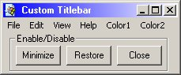



## Edit Titlebar Style \(Colors,\.\.\.\) within your App v2 NO FAKE \- MUST SEE

### Description

My Code changes the Titlebar Style in your App. You can specify two Colors for the Gradient in the Titlebar and you can choose the Gradient Angle. It's a must see code ;-) When you like then please vote for me ...
 
### More Info
 

             |
---                |---
**Submitted On**   |2000-05-29 15:54:40
**By**             |[J\.\-A\.Mock](https://github.com/Planet-Source-Code/PSCIndex/blob/master/ByAuthor/j-a-mock.md)
**Level**          |Advanced
**User Rating**    |4.8 (38 globes from 8 users)
**Compatibility**  |VB 4\.0 \(32\-bit\), VB 5\.0, VB 6\.0
**Category**       |[Custom Controls/ Forms/  Menus](https://github.com/Planet-Source-Code/PSCIndex/blob/master/ByCategory/custom-controls-forms-menus__1-4.md)
**World**          |[Visual Basic](https://github.com/Planet-Source-Code/PSCIndex/blob/master/ByWorld/visual-basic.md)
**Archive File**   |[CODE\_UPLOAD62135292000\.zip](https://github.com/Planet-Source-Code/j-a-mock-edit-titlebar-style-colors-within-your-app-v2-no-fake-must-see__1-8445/archive/master.zip)

